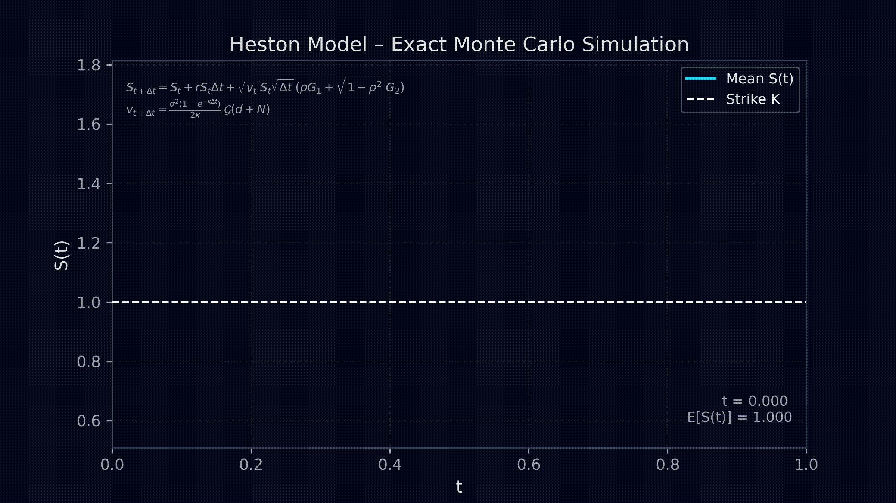
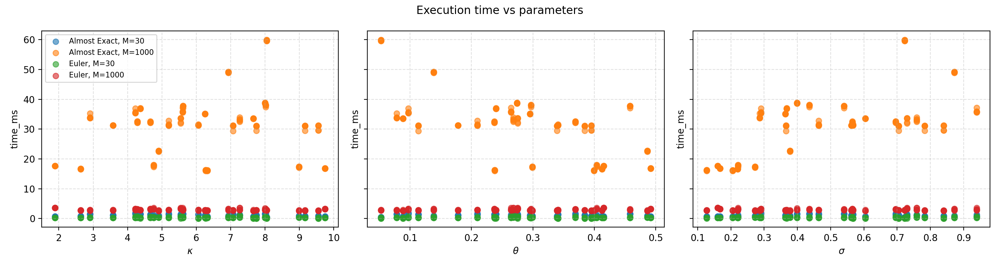

# Heston Model – GPU Monte Carlo Pricing

CUDA implementation of Monte Carlo pricing for a European call option under the
Heston stochastic volatility model.

The core of the project consists of three CUDA programs:

- `heston_1.cu` – Euler discretisation of $(S_t, v_t)$
- `heston_2.cu` – (almost) exact simulation of the variance process
- `heston_3.cu` – performance benchmark over many parameter sets

On top of that, a small Python toolkit is provided to analyse benchmark results
and to animate a subset of simulated price paths.

---

## Mathematical model (short)

We consider the Heston model

$$
\begin{aligned}
dS_t &= r S_t \,dt + \sqrt{v_t}\, S_t \, d\widetilde W_t, \\
dv_t &= \kappa(\theta - v_t)\,dt + \sigma \sqrt{v_t}\, dW_t, \\
\widetilde W_t &= \rho W_t + \sqrt{1-\rho^2}\, Z_t,
\end{aligned}
$$

and price a European call

$$
C_0 = e^{-rT}\,\mathbb{E}[(S_T - K)^+].
$$

In the “almost exact” scheme the variance step uses the CIR
noncentral–chi–square / gamma representation

$$
v_{t+\Delta t}
=
\frac{\sigma^2 (1 - e^{-\kappa \Delta t})}{2\kappa}\;\mathcal G(d + N),
$$

with $N\sim\mathrm{Poisson}(\lambda)$ and $\mathcal G(\cdot)$ a gamma random
variable.

---

## Repository layout

```text
HestonModel_Finance/
├── README.md
├── docs/
│   └── subjects.pdf              # project assignment
├── src/
│   ├── compile.sh                # helper script to build all CUDA codes
│   ├── heston_1.cu               # Step 1 – Euler scheme
│   ├── heston_2.cu               # Step 2 – exact / almost exact variance
│   └── heston_3.cu               # Step 3 – benchmark
├── graphs/
│   ├── analyze_benchmark.py      # plots from benchmark_results.csv
│   ├── animate_paths.py          # animation for selected price paths
│   └── heston_paths.cu           # Euler paths → results/paths.csv
└── results/
		├── benchmark_results.csv
		├── boxplot_time_by_method_M.png
		├── scatter_time_vs_params.png
		├── hist_price_diff.png
		├── hist_rel_error.png
		├── paths.csv
		├── payoff_vs_time.png
		├── demo_heston_2.mp4
		└── heston_paths_trading_style.mp4
```

---

## Build & run – CUDA programs

### Requirements (GPU side)

- NVIDIA GPU with compute capability ≥ `sm_70`
- CUDA toolkit (`nvcc`, `curand`)

All examples below assume you are in the repository root.

---

## Step 1 – Euler discretisation (`src/heston_1.cu`)

Goal: basic Monte Carlo pricing using Euler steps for both $S_t$ and $v_t$,
with two ways of truncating the variance:

- $g(x)=x^+=\max(x,0)$
- $g(x)=|x|$

Each GPU thread simulates one independent path with

$$
S_{t+\Delta t} = S_t + r S_t\,\Delta t + \sqrt{v_t}\, S_t\, \sqrt{\Delta t}\,(\rho\,G_1 + \sqrt{1-\rho^2}\,G_2),
$$

and stores the terminal payoff $(S_T-K)^+$ in global memory.

Typical configuration in the code:

```text
THREADS_PER_BLOCK = 256
NUM_BLOCKS        = 1024
TOTAL_PATHS       = 262144
M                 = 1000  # time steps
```

Compile & run:

```bash
cd src
nvcc -o heston_1 heston_1.cu -lcurand -arch=sm_70
./heston_1
cd ..
```

---

## Step 2 – Exact / almost exact scheme (`src/heston_2.cu`)

Goal: remove the bias of the Euler scheme on the variance by:

- simulating $v_t$ with the gamma–based exact law of the CIR process (Poisson + gamma),
- using the closed–form representation of $\int_0^T \sqrt{v_s}\, dW_s$, 
- drawing $S_T$ from a log–normal variable with parameters depending on $v_0$, $v_T$ and $\int_0^T v_s\, ds$.

Key ingredients:

- device function `gamma_distribution(curandState*, float alpha)` implementing Andersen’s algorithm with non-recursive handling of `alpha < 1`,
- kernel `heston_exact_kernel` that
	- loops over time, updates $v_t$ exactly and accumulates $v_I \approx \int_0^T v_s\, ds$,
	- computes the Brownian integral and the log-spot parameters,
	- samples $S_T$ with a single Gaussian,
	- writes the payoff.

Compile & run:

```bash
cd src
nvcc -o heston_2 heston_2.cu -lcurand -arch=sm_70
./heston_2
cd ..
```

The program prints the estimated option price and the GPU time for
`TOTAL_PATHS = 262144` and `M = 1000`.

---

## Step 3 – Performance benchmark (`src/heston_3.cu`)

Goal: compare execution time and prices of

- Euler scheme
- “Almost exact” scheme

over a parameter grid:

- $\kappa\in[0.1,10]$
- $\theta\in[0.01,0.5]$
- $\sigma\in[0.1,1]$
- $\rho\in\{-0.7,-0.3,0,0.3,0.7\}$
- time steps $M\in\{1000,30\}$

subject to the Feller condition $2\kappa\theta>\sigma^2$.

For each test:

- Euler and Almost Exact are run with `TOTAL_PATHS = 262144` paths,
- GPU times are measured with CUDA events,
- results are stored in `results/benchmark_results.csv`.

Compile & run:

```bash
cd src
nvcc -o heston_3 heston_3.cu -lcurand -arch=sm_70
./heston_3
cd ..
```

---

## Optional: Python tools (analysis & animations)

### Requirements (Python side)

- Python ≥ 3.8
- `numpy`, `pandas`, `matplotlib`
- `ffmpeg` available on the system PATH (for MP4 export)

Example environment:

```bash
conda create -n heston python=3.12
conda activate heston
pip install numpy pandas matplotlib
# install ffmpeg with your OS package manager
```

All Python commands below assume you run them from the repository root.

---

## Benchmark plots (`graphs/analyze_benchmark.py`)

After running `heston_3` you should have `results/benchmark_results.csv`.

Analyse it with:

```bash
conda activate heston
python graphs/analyze_benchmark.py
```

This script produces several figures under `results/`, including



Figure – Execution time vs Heston parameters $\kappa,\theta,\sigma$.
Each dot corresponds to one CUDA run with 262,144 simulated paths.
Colours distinguish Euler / Almost Exact and $M\in\{30,1000\}$.

Other figures:

- `results/boxplot_time_by_method_M.png` – boxplot of timings grouped by method and $M$
- `results/hist_price_diff.png` – histogram of price differences (Almost Exact $M=30$ vs Euler $M=1000$)
- `results/hist_rel_error.png` – histogram of relative errors.

---

## Saving sample paths (`graphs/heston_paths.cu`)

To create a small set of full price paths suitable for visualisation:

```bash
nvcc -o heston_paths graphs/heston_paths.cu -lcurand -arch=sm_70
./heston_paths
```

This runs an Euler simulation (with the same settings as Step 1) and writes

```text
results/paths.csv
```

with:

- first column: time grid $t_0,\ldots,t_M$,
- next columns: $N_{\mathrm{SAVE}}=50$ full paths $S_t^{(i)}$.

---

## Path animation (`graphs/animate_paths.py`)

Once `results/paths.csv` exists, you can generate a dark “trading-style”
animation:

```bash
conda activate heston
python graphs/animate_paths.py
```

This produces:

```text
results/heston_paths_trading_style.mp4
```

The animation shows:

- a dark background chart,
- about 20 sample paths (subset of the 50 saved),
- the mean path $\mathbb{E}[S(t)]$ as a brighter line,
- the strike $K$ as a white dashed horizontal line,
- an overlay with the current time $t$ and the current value of $\mathbb{E}[S(t)]$.

