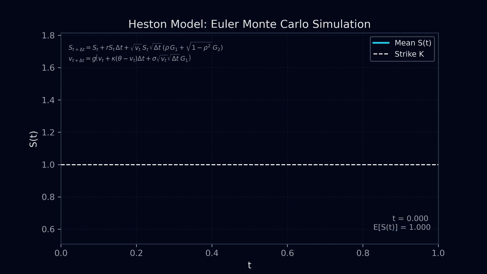

# Heston Model – GPU Monte Carlo Pricing (CUDA)

CUDA Monte Carlo pricing for a European call under the Heston stochastic volatility model.

## Summary

This repository implements GPU-accelerated Monte Carlo schemes (CUDA) to price a European call option under the Heston stochastic volatility model. It contains three CUDA programs that progressively improve the variance discretisation and a set of Python utilities in `graphs/` to produce plots and animations from the generated CSV outputs.

Core programs:
- `src/heston_1.cu` – Step 1: Euler scheme for $(S_t, v_t)$
- `src/heston_2.cu` – Step 2: exact CIR transition for $v_t$ (Poisson–Gamma / noncentral chi-square) + terminal pricing
- `src/heston_3.cu` – Step 3: benchmark (runtime / price) over many parameter sets and time steps

Python utilities in `graphs/` generate plots and animations from CSV outputs.

---

## Model (short)

Heston dynamics:
$$
\begin{aligned}
dS_t &= r S_t\,dt + \sqrt{v_t}\,S_t\,dW_t^{(1)},\\
dv_t &= \kappa(\theta - v_t)\,dt + \sigma\sqrt{v_t}\,dW_t^{(2)},\\
\mathrm{corr}(dW_t^{(1)}, dW_t^{(2)}) &= \rho,\qquad \rho\in[-1,1].
\end{aligned}
$$

European call price:
$$
C_0 = e^{-rT}\,\mathbb{E}\big[(S_T-K)^+\big].
$$

---

## Implementation Overview

Step 1 — Euler scheme (`src/heston_1.cu`)

Each GPU thread simulates one independent path. Correlated standard Gaussians $G_1,G_2\sim\mathcal{N}(0,1)$ are combined to obtain the Brownian increments:
$$
\Delta W^{(1)} = \sqrt{\Delta t}\,G_1,\qquad
\Delta W^{(2)} = \sqrt{\Delta t}\,(\rho G_1 + \sqrt{1-\rho^2}\,G_2).
$$

The Euler discretisation (with simple variance truncation) reads:
$$
\begin{aligned}
S_{t+\Delta t} &= S_t + r S_t\Delta t + S_t\sqrt{v_t}\,\Delta W^{(1)},\\
v_{t+\Delta t} &= g\big(v_t + \kappa(\theta - v_t)\Delta t + \sigma\sqrt{v_t}\,\Delta W^{(2)}\big),
\end{aligned}
$$
where $g(x)$ enforces non-negativity (for example $g(x)=\max(x,0)$ or $g(x)=|x|$). Payoffs are reduced to a single price estimate (discounted sample average of $(S_T-K)^+$).

Step 2 — Exact variance transition (`src/heston_2.cu`)

The variance $v_t$ follows a CIR process. This step uses its exact transition distribution (equivalently the noncentral chi-square law, implemented as a Poisson–Gamma mixture) to sample $v_{t+\Delta t}$ exactly. Implementation highlights:
- device Gamma sampler that handles both shape regimes ($\alpha\ge1$ and $\alpha<1$),
- per-thread time loop updating $v_t$ exactly and computing the terminal payoff,
- outputs only the terminal price estimate (no full path saved).

Step 3 — Benchmark (`src/heston_3.cu`)

Runs both methods (Euler / Almost Exact) across many parameter sets and time steps and writes `results/benchmark_results.csv` with columns: (params, M, $\Delta t$, method, time_ms, price).

---

## Repository layout

```
HestonModel_Finance/
├── docs/
│   └── subjects.pdf
├── src/
│   ├── compile.sh
│   ├── heston_1.cu
│   ├── heston_2.cu
│   └── heston_3.cu
├── graphs/
│   ├── animate_paths.py
│   ├── animate_paths_euler.py
│   ├── heston_paths.cu
│   ├── make_scatterplot.py
│   ├── plot_error.py
│   └── plot_performance.py
└── results/
	├── benchmark_results.csv
	├── fig_error_vs_dt_ref_AE_M1e5.pdf
	├── fig_hist_deltaP_Euler_minus_AE_ref_M1e5_M30.pdf
	├── heston_euler_paths.gif
	├── hist_price_diff.png
	├── par_k.png
	├── par_theta.png
	├── par_sigma.png
	├── paths.csv
	└── scatterplot_k_theta_sigma.png
```

## Build & run (CUDA)

Requirements:
- NVIDIA GPU (tested with `sm_70`)
- CUDA toolkit (`nvcc`) + `curand`

From repo root:

```sh
cd src
bash compile.sh
./heston_1
./heston_2
./heston_3
cd ..
```

Alternatively, compile a single file:

```sh
cd src
nvcc -O3 -o heston_1 heston_1.cu -lcurand -arch=sm_70
./heston_1
cd ..
```

## Python utilities (plots & animations)

Python requirements:
- `numpy`, `pandas`, `matplotlib`
- `ffmpeg` (for MP4 / GIF export)

Use the scripts in `graphs/` to generate figures from the CSV outputs in `results/`.

---

If you want, I can:
- run a quick check that `readme.md` was written correctly,
- open or preview the GIF in `results/heston_euler_paths.gif`,
- or commit the updated `readme.md`.
